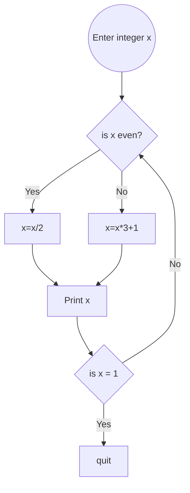

# pands-problem-sheet

## Weekly Task 01
### helloworld.py
```
Commit and push a file to the problem sheet called helloworld.py
This file should contain a python program that displays Hello World! when it is run.
```
```python
print("Hello World!")
```

## Weekly Task 02
### Bank.py
```
The program should:
-   Prompt the user and read in two money amounts (in cent)
-   Add the two amounts
-   Print out the answer in a human readable format with a euro 
    sign and decimal point between the euro and cent of the amount
```  
```python
amount1 = int(input("Enter amount1 in cents: "))
amount2 = int(input("Enter amount2 in cents: "))
sum = amount1 + amount2
print(f'The sum of these is €{(sum / 100)}')
```
I used f-Strings which makes string formatting easier and makes the code easier to understand.
[Click here to learn more about f-Strings](https://realpython.com/python-f-strings/)
## Weekly Task 03
### accounts.py
```
Write a python program called **accounts.py** that reads in a 10 character account number and 
outputs the account number with only the last 4 digits showing (and the first 6 digits replaced with Xs).
```
```python
account_number = input("Please enter an 10 digit account number: ")
visible_number = account_number[6:10]
hidden_number = 'XXXXXX'
print(hidden_number + visible_number)
```
 I got a lot of information on Python strings at W3Schools [here](https://www.w3schools.com/python/python_strings.asp) and on Python string methods [here](https://www.w3schools.com/python/python_ref_string.asp).
 
There was also an extra part to this task.
```
Extra:
Modify the program to deal with account numbers of any length (yes that is a vague 
requirement, comment your assumptions)
```
```python
hidden_numbers = ''
account_number = input("Please enter an account number: ")
visible_numbers = account_number[(len(account_number)- 4):len(account_number)]

for  i  in  range(0, (len(account_number)- 4)):
hidden_numbers += 'X'
print(hidden_numbers + visible_numbers)
```
This code allows all keyboard characters to be used, I was going to add checks to ensure only numeric or alpha-numeric characters were used, but as applications usually only display account numbers  in this format to show users which one of their accounts was used, I felt it wasn't necessary.

## Weekly Task 04
### collatz.py
``` 
Write a program, called collatz.py, that asks the user to input any positive integer and outputs the successive values of the following calculation.
At each step calculate the next value by taking the current value and, if it is even, divide it by two, but if it is odd, multiply it by three and add one.
Have the program end if the current value is one.

Example of it running:
$ python collatz.py
Please enter a positive integer: 10
10 5 16 8 4 2 1

Output requires formatting to print all numbers on the same line
```

```python
start_number = int(input("Please enter a positive integer: "))
print(start_number, end = ' ') 
 
while  start_number > 1:
	if  start_number % 2 == 0: # checks if even
		start_number //= 2  # // keeps results as integers
	else:
		start_number = (start_number * 3) + 1
print(start_number, end = ' ')
```

### Weekly Task 05
#### weekday.py
Write a program that outputs whether or not today is a weekday.

E.G. for Thursday:
```
Yes, unfortunately today is a weekday.
```
For sunday:
```
It is the weekend, yay!
```

I used both the datetime and time modules in my code.

click [Datetime](https://docs.python.org/3/library/datetime.html) or 
[Time](https://docs.python.org/3/library/time.html?highlight=time#module-time) for usage information at docs.python.org

```python
time.strftime("%A")
```
Gets the name of the weekday(Sunday, Monday etc.).
```python
datetime.datetime.now()
```
Gets the current date and time. I used
```python
datetime.date.fromisoformat('2023-02-24')
```
for testing my code(e.g. for above, 24 was friday).
```python
date_time.isoweekday()
```
This returns the day of the week in number form where 1 is Monday, 2 is Tuesday and so on.

