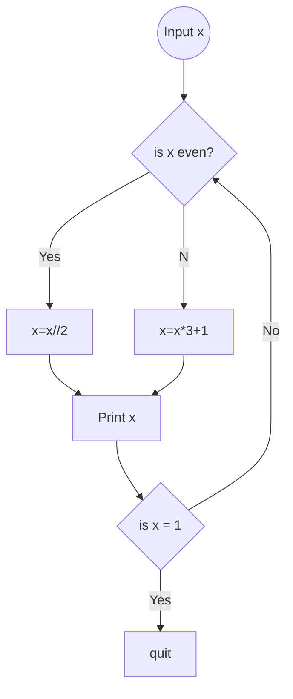

# pands-problem-sheet

## Weekly Task 01
### helloworld.py
The Task:
```
Commit and push a file to the problem sheet called helloworld.py
This file should contain a python program that displays Hello World! when it is run.
```
The Code:
```python
print("Hello World!")
```

## Weekly Task 02
### Bank.py
The Task:
```
The program should:
-   Prompt the user and read in two money amounts (in cent)
-   Add the two amounts
-   Print out the answer in a human readable format with a euro sign and decimal 
    point between the euro and cent of the amount
``` 
The Code: 
```python
amount1 = int(input("Enter amount1 in cents: "))
amount2 = int(input("Enter amount2 in cents: "))
sum = amount1 + amount2
print(f'The sum of these is €{(sum / 100)}')
```
I used f-Strings which makes string formatting easier and makes the code easier to understand.
[Click here to learn more about f-Strings](https://realpython.com/python-f-strings/)
## Weekly Task 03
### accounts.py
The Task:
```
Write a python program called **accounts.py** that reads in a 10 character account number and 
outputs the account number with only the last 4 digits showing (and the first 6 digits replaced with Xs).
```
The Code:
```python
account_number = input("Please enter an 10 digit account number: ")
visible_number = account_number[6:10]
hidden_number = 'XXXXXX'
print(hidden_number + visible_number)
```
 I got a lot of information on Python strings at W3Schools [here](https://www.w3schools.com/python/python_strings.asp) and on Python string methods [here](https://www.w3schools.com/python/python_ref_string.asp).
 
There was also an extra part to this task.
```
Extra:
Modify the program to deal with account numbers of any length (yes that is a vague 
requirement, comment your assumptions)
```
The Final Code:
```python
hidden_numbers = ''
account_number = input("Please enter an account number: ")
visible_numbers = account_number[(len(account_number)- 4):len(account_number)]

for  i  in  range(0, (len(account_number)- 4)):
    hidden_numbers += 'X'
print(hidden_numbers + visible_numbers)
```
This code allows all keyboard characters to be used, I was going to add checks to ensure only numeric or alpha-numeric numbers were used, but as applications usually only display account numbers  in this format to show users which one of their accounts was used, I felt it wasn't necessary.

## Weekly Task 04
### collatz.py
The Task:
``` 
Write a program, called collatz.py, that asks the user to input any positive 
integer and outputs the successive values of the following calculation.
At each step calculate the next value by taking the current value and, if it is 
even, divide it by two, but if it is odd, multiply it by three and add one.
Have the program end if the current value is one.

Example of it running:
$ python collatz.py
Please enter a positive integer: 10
10 5 16 8 4 2 1

Output requires formatting to print all numbers on the same line
```
Program Flow:

The Code:
```python
number = int(input("Please enter a positive integer: "))
print(number, end = ' ') 
 
while number > 1:
	if number % 2 == 0:
		number //= 2
	else:
		number = (start_number * 3) + 1
print(start_number, end = ' ')
```
I used the // operator to ensure that an integer was returned after each division and the % operator to check if the number was even as there is no remainder when an even number is divided by 2.

## Weekly Task 05  
#### weekday.py
The Task:
```
Write a program that outputs whether or not today is a weekday.
An example of running this program on a Thursday is given below.
$ python weekday.py
`Yes, unfortunately today is a weekday.`

An example of running it on a Saturday is as follows:
$ python weekday.py
`It is the weekend, yay!`
```
The Code:
```python
import  datetime, time

weekday = time.strftime("%A")
date_time = datetime.datetime.now()
weekday_number = date_time.isoweekday()

print(f'Today is {weekday}, day {weekday_number} of the week')

if  weekday_number > 5:
	print('It is the weekend, yay!')
else:
	print('Yes, unfortunately today is a weekday.')
```
I used both the datetime and time modules in my code. 
click [Datetime](https://docs.python.org/3/library/datetime.html) or [Time](https://docs.python.org/3/library/time.html?highlight=time#module-time) for usage information at docs.python.org

For testing replace:
```python
date_time = datetime.datetime.now()
```
with
```python
date_time = datetime.date.fromisoformat('2023-02-24')
```
Where you know what day of the week the date occurred on.
  
## Weekly Task 06 
#### square_root.py
The Task:
```
Write a program that takes a positive floating-point number as input and outputs an approximation of 
its square root.  
You should create a function called sqrt() that does this.
I am asking you to create your own sqrt function and not to use the built in functions 
x ** .5 or math.sqrt(x).  
This is to demonstrate that you can research and code a process (If you really needed the square 
root you would use one of the above methods).
I suggest that you look at the newton method at estimating square roots.
This is a more difficult task than some of the others, but will be marked equally, so only do as much 
work on this as you feel comfortable.

$ python square_root.py  
Please enter a positive number: 14.5
The square root of 14.5 is approx. 3.8.
```
The Code:
```python
def  mySqrt(x):
'''Calculates a square root'''
	r = x
	precision = 10 ** (-10)

	while  abs(x - r * r) > precision:
		r = (r + x / r) / 2
	return  r

num = float(input('Please enter a positive number: '))
print(f'The square root of {num} is approx. {mySqrt(num)}')
```
Below is the formula for the calculation that's carried out inside the while loop:

$r = \frac{(x/r)+r}{2}$ 

r is updated each time the while loop is cycled through and here we can see the value for r getting more precise for each iteration. 
```
Please enter a positive number: 14.5
 for this iteration r = 14.5 x = 14.5
 for this iteration r = 7.75 x = 14.5
 for this iteration r = 4.810483870967742 x = 14.5
 for this iteration r = 3.912366830706 x = 14.5
 for this iteration r = 3.8092816328050976 x = 14.5
 for this iteration r = 3.807886808393225 x = 14.5
The square root of 14.5 is approx. 3.8078865529319628
```

## Weekly Task 07
#### es.py
The Task:
```
Write a program that reads in a text file and outputs the number of e's it contains.
The program should take the filename from an  **argument** on the command line. 

$ python es.py moby-dick.txt
116960
```
The Code:
```python
import  sys

arg = sys.argv
FILENAME = arg[1]

def  read_text():
	with  open(FILENAME) as  f:
		text = f.read()
		return  text

# Main
text = read_text()
count = text.count('e') + text.count('E')
print (count)
```
For information on Command Line Arguments visit [Real Python](https://realpython.com/python-command-line-arguments/) and [W3Schools](https://www.w3schools.com/python/ref_string_count.asp) for more on the Python String Count Method. 